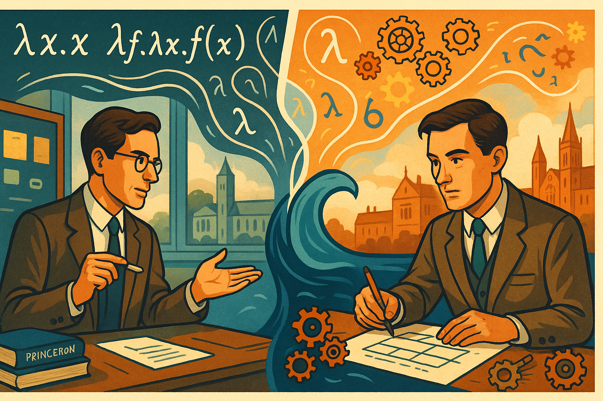

# Alonzo Church and the Legacy of Lambda Calculus

## Panel 1: The Mathematical Crisis

   
Panel 1: Princeton, 1930 - A Young Logician's Vision

   
Wide landscape panel showing a young Alonzo Church in his Princeton University office, surrounded by chalkboards covered in mathematical symbols and logical formulas. The room is filled with warm golden light streaming through tall windows. Church, a thin man with glasses, stands contemplatively before a blackboard with Russell's Paradox written on it. Books by Russell, Whitehead, and Hilbert are scattered on his desk. The color palette features bright blues and golds, representing the dawn of a new mathematical era. In the background, we can see other mathematicians working, suggesting the collaborative atmosphere of Princeton's mathematics department during the foundational crisis period.

## Panel 2: The Foundation Problem

   
Panel 2: The Search for Mathematical Truth

   
Please generate a consistent graphic novel panel using a wide-landscape format.  The panel showing Church in animated discussion with colleagues around a conference table. Mathematical paradoxes float like thought bubbles above their heads - Russell's Paradox, the Liar Paradox, and Cantor's diagonal argument visualized as geometric shapes. The scene uses vibrant purples and oranges to show the intensity of mathematical debate. Church gestures toward a diagram showing the hierarchy of mathematical systems, with question marks indicating the gaps in understanding. Other mathematicians look puzzled or concerned, representing the mathematical community's struggle with foundational issues. The background shows equations dissolving or transforming, symbolizing the instability of mathematical foundations.

## Panel 3: The Birth of an Idea

   
Panel 3: Lambda is Born

Panel 3: Lambda is Born
Please generate a consistent graphic novel panel using a wide-landscape format. Church alone in his study late at night, illuminated by a desk lamp casting dramatic shadows. On the chalkboard before him, we see the first lambda expressions taking shape: λx.x, λf.λx.f(x), etc. The lambda symbol (λ) glows with a soft electric blue light, as if it's a breakthrough moment. The room is rendered in deep blues and teals with bright yellow highlights from the lamp. Coffee cups and crumpled papers litter the desk, showing the intensity of his work. Through the window, we can see the Princeton campus sleeping, emphasizing Church's solitary dedication. Mathematical symbols seem to dance around him, suggesting the birth of a new mathematical language.

## Panel 4: The Presentation Challenge

   
Panel 4: Blank Stares and Confusion

   
Panel 4: Blank Stares and Confusion
Please generate a consistent graphic novel panel using a wide-landscape format. A wide panel showing Church presenting his lambda calculus to a lecture hall full of mathematicians and logicians. Church stands at the front with confidence, pointing to lambda expressions on the blackboard, but the audience looks completely bewildered. Thought bubbles show their confusion - question marks, tangled symbols, and frustrated expressions. The color scheme uses contrasting bright greens and reds to show the disconnect between Church's clarity and the audience's confusion. Some audience members are scratching their heads, others are whispering to neighbors, and a few are even dozing off. The lambda expressions on the board seem alien and incomprehensible to everyone except Church.

## Panel 5: The Simplification Strategy

   
Panel 5: Back to Basics

   
Panel 5: Back to Basics
Please generate a consistent graphic novel panel using a wide-landscape format.
Church in his office, now with a different approach. Instead of complex formulas, he's drawing simple diagrams and basic examples on the board. The scene shows him breaking down lambda calculus into its three fundamental components: variables (shown as colorful boxes), abstraction (shown as function machines), and application (shown as arrows connecting inputs to outputs). The palette uses bright, friendly colors - yellows, light blues, and greens - to represent this more approachable method. His desk now has children's building blocks and simple mechanical toys, suggesting he's thinking about fundamental, intuitive concepts rather than abstract mathematics.

## Panel 6: The Turing Connection

   
Panel 6: Two Minds, One Truth

   
Panel 6: Two Minds, One Truth
Please generate a consistent graphic novel panel using a wide-landscape format.
A split panel showing Church on the left and Alan Turing on the right, separated by the Atlantic Ocean (shown as a stylized blue wave in the center). Both are working on computation - Church with lambda expressions, Turing with his machine concepts. Ghostly connections flow between them, suggesting their parallel discoveries. The color scheme uses complementary blues and oranges to show their different but connected approaches. Mathematical symbols and mechanical gears float between them, representing the convergence of their ideas. In the background, we can see Princeton on one side and Cambridge on the other, emphasizing the international nature of this mathematical breakthrough.

## Panel 7: The Breakthrough Moment

   
Panel 7: Equivalence Revealed

Panel 7: Equivalence Revealed
Please generate a consistent graphic novel panel using a wide-landscape format.
A dramatic wide panel showing the moment Church realizes that lambda calculus and Turing machines are equivalent in computational power. The scene shows Church at his desk with papers spread out, making connections between lambda expressions and Turing machine states. Bright lines of realization connect different concepts, rendered in electric blues and bright whites. The Church-Turing thesis materializes as a glowing equation floating above his head. The background shows both lambda symbols and mechanical gears working in harmony, representing the unification of abstract mathematics and mechanical computation. Church's expression shows the joy of mathematical discovery.

## Panel 8: Early Adoption Struggles

   
Panel 8: The Practical Problem

Panel 8: The Practical Problem
Please generate a consistent graphic novel panel using a wide-landscape format.

Church presenting lambda calculus to early computer pioneers and engineers in the 1940s-50s. The scene shows him in front of room-sized computers (ENIAC-style) trying to explain how lambda calculus could be relevant to practical computing. The engineers and programmers look skeptical, surrounded by punch cards, vacuum tubes, and mechanical switches. The color palette contrasts Church's bright, theoretical world (blues and purples) with the brown, mechanical world of early computing. Thought bubbles show the engineers thinking about practical concerns - memory limitations, processing speed, and hardware constraints - while Church's ideas seem too abstract for immediate application.

## Panel 9: The Programming Language Revolution

   
Panel 9: LISP and the First Implementations

Panel 9: The Programming Language Revolution

Please generate a consistent graphic novel panel using a wide-landscape format.

A vibrant panel showing John McCarthy and others implementing lambda calculus concepts in early programming languages like LISP. The scene shows computer scientists at MIT working with early computers, with lambda expressions being translated into actual code. The color scheme is bright and optimistic - greens, blues, and yellows - showing the excitement of making Church's abstract ideas practical. Code snippets flow like ribbons across the panel, connecting mathematical theory to programming practice. In the background, we see the evolution from Church's handwritten lambda expressions to printed computer code, representing the bridge between pure mathematics and applied computer science.

## Panel 10: Modern Programming Renaissance

   
Panel 10: Functional Programming's Rise

Panel 10: Functional Programming's Rise

Please generate a consistent graphic novel panel using a wide-landscape format.

A contemporary scene showing modern programmers working with functional programming languages (Haskell, JavaScript, Python) on laptops and modern computers. Lambda functions are visualized as flowing, organic shapes connecting different parts of code. The panel uses bright, modern tech colors - electric blues, neon greens, and cyber purples. Multiple screens show lambda expressions in different programming contexts - web development, data science, artificial intelligence. The programmers look engaged and productive, showing how Church's ideas have finally found their practical home. Code flows like energy streams between the computers, representing the interconnected nature of modern functional programming.

## Panel 11: Lambda's Hidden Influence

   
Panel 11: Everywhere You Look

Panel 11: Everywhere You Look
Please generate a consistent graphic novel panel using a wide-landscape format.

A wide, bustling panel showing lambda calculus concepts embedded throughout modern technology. The scene shows a smart city with various applications highlighted: smartphones running apps with functional code, web servers processing lambda functions in the cloud, AI systems using lambda calculus for neural networks, and autonomous vehicles using functional programming for safety-critical systems. Each application is connected by flowing lambda symbols rendered in bright, electric colors. The palette uses a full spectrum of bright, tech-forward colors to show the diversity of applications. Hidden lambda symbols appear in unexpected places - traffic light algorithms, social media feeds, and financial trading systems.

## Panel 12: The Eternal Lambda

   
Panel 12: Church's Legacy Lives On

Panel 12: Church's Legacy Lives On
Please generate a consistent graphic novel panel using a wide-landscape format.

A majestic final panel showing an older, wiser Church in the present day (imagined if he were still alive), surrounded by the digital world his lambda calculus helped create. The scene shows him in a modern university setting, with holographic displays showing lambda expressions being used in quantum computing, advanced AI, and future technologies. The color palette is bright and ethereal - golds, electric blues, and radiant whites - suggesting timelessness and continuing influence. Students of various backgrounds work with lambda concepts on futuristic interfaces. In the sky above, lambda symbols form constellation patterns, suggesting that Church's mathematical poetry has become fundamental to the structure of our digital universe. The final image shows that what began as abstract mathematics has become the hidden language of modern civilization.

   
Cover Image

   Cover Image:

   Please generate a cover image using a wide-landscape format for this graphic novel about About Alonzo Church and the development of Lambda Calculus.  The title is: "Alonzo Church and the Legacy of Lambda Calculus"

## Narrative Arc Summary

This graphic novel follows Alonzo Church's journey from a young mathematician grappling with foundational crises in mathematics to the creator of one of the most influential concepts in computer science. The story emphasizes:

**Key Themes:**
- **The Challenge of Communication**: Church's struggle to explain abstract mathematical concepts to practical-minded audiences
- **Theoretical Foundation**: How pure mathematics eventually enables practical applications
- **Persistence and Vision**: Church's dedication despite initial skepticism and misunderstanding
- **Unexpected Connections**: The surprising links between mathematical theory and technological innovation

**Modern Impact Examples Highlighted:**
- **Web Development**: Lambda functions in JavaScript for event handling and functional programming
- **Cloud Computing**: Serverless computing (AWS Lambda) for scalable applications
- **Artificial Intelligence**: Functional programming paradigms in machine learning frameworks
- **Data Processing**: MapReduce and functional approaches to big data analysis
- **Programming Languages**: Modern languages like Haskell, Clojure, and F# built on lambda calculus principles
- **Type Systems**: Advanced type systems in languages like TypeScript and Rust based on Church's type theory

The graphic novel demonstrates how Church overcame communication challenges by:
1. **Simplifying Examples**: Moving from abstract proofs to concrete, visual representations
2. **Finding Practical Applications**: Connecting theory to emerging computer science needs
3. **Building Community**: Working with other mathematicians and computer scientists
4. **Persistent Education**: Continuing to teach and refine his explanations over decades

This narrative structure provides students with both historical context and modern relevance, showing how foundational mathematical work eventually transforms technology and society.

## References

1.  [Alonzo Church - Wikipedia](https://en.wikipedia.org/wiki/Alonzo_Church) - 2025 - Wikipedia - Comprehensive biographical article covering Church's life, major contributions including lambda calculus, and his role as one of the founders of computer science
2.  [Learn Lambda Calculus in Y Minutes](https://learnxinyminutes.com/lambda-calculus/) - 2024 - Learn X in Y Minutes - Interactive tutorial perfect for beginners showing how lambda calculus works with concrete examples and clear explanations of syntax
3.  [Alonzo Church - Stanford Encyclopedia of Philosophy](https://plato.stanford.edu/entries/church/) - 2021 - Stanford Encyclopedia of Philosophy - Scholarly but accessible overview of Church's philosophical and mathematical contributions, including detailed sections on lambda calculus and computability
4.  [Alonzo Church - Complete Biography, History, and Inventions](https://history-computer.com/people/alonzo-church-complete-biography/) - April 16, 2024 - History-Computer - Student-friendly biography focusing on Church's inventions and their modern relevance to computer science
5.  [Alonzo Church - Britannica](https://www.britannica.com/biography/Alonzo-Church) - February 19, 2009 - Encyclopædia Britannica - Concise biographical entry highlighting Church's key contributions to mathematical logic and theoretical computer science foundations
6.  [A Gentle Introduction to Lambda Calculus - Part 1: Syntax](https://lucasfcosta.com/2018/07/29/An-Introduction-to-Lambda-Calculus-Part-1.html) - July 29, 2018 - Lucas F. Costa's Blog - Beginner-friendly tutorial explaining lambda calculus concepts with JavaScript examples, perfect for students familiar with programming
7.  [Lambda Calculus with JavaScript](https://medium.com/@axdemelas/lambda-calculus-with-javascript-897f7e81f259) - October 9, 2023 - Medium - Shows practical connections between Church's theoretical work and modern programming languages, demonstrating relevance to today's technology
8.  [Lambda Calculus: The Bedrock of Functional Programming](https://medium.com/@hakanapohan/lambda-calculus-the-bedrock-of-functional-programming-1435b874690f) - November 24, 2024 - Medium - Explains how Church's lambda calculus became the foundation for modern functional programming languages like Haskell, JavaScript, and Python
9.  [Alonzo Church: The Forgotten Architect of Computer Intelligence](https://onepercentrule.substack.com/p/alonzo-church-the-forgotten-architect) - November 4, 2024 - The One Percent Rule - Engaging narrative about Church's life and why his contributions, though less famous than Turing's, were equally fundamental to computer science
10.  [Exploring Lambda Calculus in Functional Programming](https://www.lenovo.com/us/en/glossary/lambda-calculus/) - 2024 - Lenovo US - Practical guide showing how lambda calculus influences modern programming, with examples of how students encounter Church's ideas in languages like JavaScript and Python

These references provide a comprehensive introduction to both Alonzo Church's life story and the lasting impact of lambda calculus, ranging from accessible biographical sketches to hands-on tutorials that demonstrate the continuing relevance of his work in modern computing.